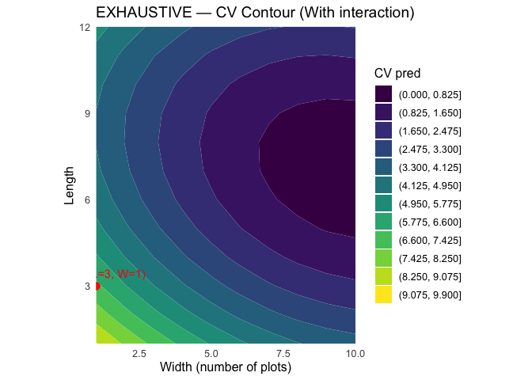
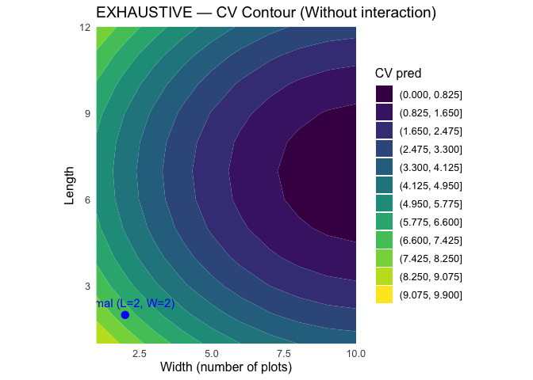
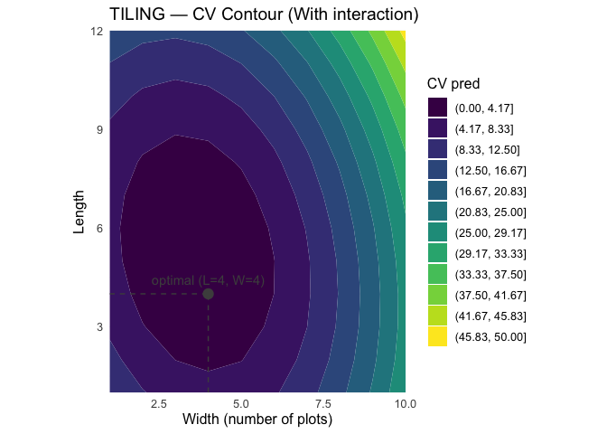

# fielddesign

<!-- badges: start -->

[](https://github.com/jcrodriguez1989/fielddesign/actions/workflows/R-CMD-check.yaml)
[](https://app.codecov.io/gh/jcrodriguez1989/fielddesign)
<!-- badges: end -->

## Installation

Install the development version of `{fielddesign}` from
[GitHub](https://github.com/jcrodriguez1989/fielddesign) with:

``` r
# install.packages("remotes")
remotes::install_github("jcrodriguez1989/fielddesign")
```

## Example

``` r
# Load the package.
library("fielddesign")

# Generate simulated data.
set.seed(420)
nr <- 12
nc <- 10
x <- matrix(rnorm(nr * nc, 500, 60), nrow = nr, ncol = nc)

# Plot the yield data.
plot_yield_contour(x)
```

<!-- -->

``` r
# Calculate the exhaustive spatial variation.
sv_exh <- spatial_variation_exhaustive(x)$res
head(sv_exh, 10)
```

    ##     Size Width Length plots        CV
    ## 1x1    1     1      1   120 12.663951
    ## 1x2    2     2      1   218  9.080967
    ## 1x3    3     3      1   196  7.320735
    ## 1x4    4     4      1   174  6.192881
    ## 2x2    4     2      2    99  6.305336
    ## 1x5    5     5      1   152  5.512580
    ## 1x6    6     6      1   130  5.141173
    ## 2x3    6     3      2   178  4.958025
    ## 1x7    7     7      1   108  4.937079
    ## 1x8    8     8      1    86  4.688225

``` r
# Calculate the optimal plot size.
exh_ops_int <- fit_optimal_plot_size(sv_exh, nr, nc)
exh_ops_no_int <- fit_optimal_plot_size(sv_exh, nr, nc, include_interaction = FALSE)

anova(exh_ops_no_int$fit, exh_ops_int$fit)
```

    ## Analysis of Variance Table
    ## 
    ## Model 1: CV ~ Length + Width + I(Length^2) + I(Width^2)
    ## Model 2: CV ~ Length + Width + I(Length^2) + I(Width^2) + Length:Width
    ##   Res.Df    RSS Df Sum of Sq      F Pr(>F)
    ## 1     69 36.205                           
    ## 2     68 35.262  1   0.94293 1.8184  0.182

``` r
AIC(exh_ops_no_int$fit, exh_ops_int$fit)
```

    ##                    df      AIC
    ## exh_ops_no_int$fit  6 169.1021
    ## exh_ops_int$fit     7 169.1492

``` r
message(sprintf(
  " With interaction  (continuous): L*= %.2f W*= %.2f  | rounded: %d %d",
  exh_ops_int$h_star, exh_ops_int$w_star,
  as.integer(ceiling(exh_ops_int$h_star)), as.integer(ceiling(exh_ops_int$w_star))
))
```

    ##  With interaction  (continuous): L*= 2.97 W*= 1.02  | rounded: 3 2

``` r
message(sprintf(
  " Without interaction  (continuous): L*= %.2f W*= %.2f  | rounded: %d %d",
  exh_ops_no_int$h_star, exh_ops_no_int$w_star,
  as.integer(ceiling(exh_ops_no_int$h_star)), as.integer(ceiling(exh_ops_no_int$w_star))
))
```

    ##  Without interaction  (continuous): L*= 1.99 W*= 2.11  | rounded: 2 3

``` r
# Calculate the tiling spatial variation.
sv_tiling <- spatial_variation_tiling(x)$res
head(sv_tiling, 10)
```

    ##     Size Width Length plots        Vx        CV
    ## 1x1    1     1      1   120 3869.7700 12.663951
    ## 2x1    2     1      2    60 2120.9326  9.375406
    ## 1x2    2     2      1    60 1722.0348  8.447877
    ## 3x1    3     1      3    40 1186.2386  7.011528
    ## 4x1    4     1      4    30 1045.3686  6.582053
    ## 2x2    4     2      2    30  963.3321  6.318510
    ## 1x5    5     5      1    24  717.7742  5.454068
    ## 6x1    6     1      6    20  556.6588  4.803095
    ## 3x2    6     2      3    20  347.2369  3.793495
    ## 4x2    8     2      4    15  249.6181  3.216360

``` r
# Calculate the optimal plot size.
opt_til_int_cont <- fit_optimal_plot_size(sv_tiling, nr, nc)
opt_til_no_int_cont <- fit_optimal_plot_size(
  sv_tiling, nr, nc,
  include_interaction = FALSE
)

reg_int <- opt_til_int_cont$fit
reg_no_int <- opt_til_no_int_cont$fit

message(sprintf(
  " With interaction  (continuous): L*= %.2f W*= %.2f  | rounded: %d %d",
  opt_til_int_cont$h_star, opt_til_int_cont$w_star,
  as.integer(ceiling(opt_til_int_cont$h_star)), as.integer(ceiling(opt_til_int_cont$w_star))
))
```

    ##  With interaction  (continuous): L*= 3.67 W*= 3.09  | rounded: 4 4

``` r
message(sprintf(
  " Without interaction  (continuous): L*= %.2f W*= %.2f  | rounded: %d %d",
  opt_til_no_int_cont$h_star, opt_til_no_int_cont$w_star,
  as.integer(ceiling(opt_til_no_int_cont$h_star)), as.integer(ceiling(opt_til_no_int_cont$w_star))
))
```

    ##  Without interaction  (continuous): L*= 3.78 W*= 3.14  | rounded: 4 4

``` r
# Models comparison.
message("\n[TILING] Models comparison (ANOVA + AIC)")
```

    ## 
    ## [TILING] Models comparison (ANOVA + AIC)

``` r
anova(reg_no_int, reg_int)
```

    ## Analysis of Variance Table
    ## 
    ## Model 1: CV ~ Length + Width + I(Length^2) + I(Width^2)
    ## Model 2: CV ~ Length + Width + I(Length^2) + I(Width^2) + Length:Width
    ##   Res.Df    RSS Df Sum of Sq      F  Pr(>F)  
    ## 1     10 6.0226                              
    ## 2      9 2.9334  1    3.0892 9.4779 0.01317 *
    ## ---
    ## Signif. codes:  0 '***' 0.001 '**' 0.01 '*' 0.05 '.' 0.1 ' ' 1

``` r
AIC(reg_no_int, reg_int)
```

    ##            df      AIC
    ## reg_no_int  6 40.88023
    ## reg_int     7 32.08994

``` r
sv_exh_cmp <- sv_exh[, c("Length", "Width", "Size", "CV")]
names(sv_exh_cmp)[4] <- "CV_exh"
tab_til_cmp <- sv_tiling[, c("Length", "Width", "CV")]
names(tab_til_cmp)[3] <- "CV_til"
comp <- merge(sv_exh_cmp, tab_til_cmp, by = c("Length", "Width"))
message(sprintf("n intersection = %d", nrow(comp)))
```

    ## n intersection = 7

``` r
message(sprintf("Correlation: %.4f", cor(comp$CV_exh, comp$CV_til, use = "complete.obs")))
```

    ## Correlation: 0.9857

``` r
message(sprintf("Mean bias (exh - til): %.4f", mean(comp$CV_exh - comp$CV_til, na.rm = TRUE)))
```

    ## Mean bias (exh - til): -0.0480

``` r
message(
  sprintf("Median bias (exh - til): %.4f", median(comp$CV_exh - comp$CV_til, na.rm = TRUE))
)
```

    ## Median bias (exh - til): 0.0115

``` r
# CV Plots.
plot_cv_contour(
  exh_ops_int$fit,
  nr = nr, nc = nc,
  title = "EXHAUSTIVE — CV Contour (With interaction)",
  mark = data.frame(Length = exh_ops_int$h_opt, Width = exh_ops_int$w_opt),
  mark_col = "red",
  mark_lab = paste0("optimal (L=", exh_ops_int$h_opt, ", W=", exh_ops_int$w_opt, ")")
)
```

<!-- -->

``` r
plot_cv_contour(
  exh_ops_no_int$fit,
  nr = nr, nc = nc,
  title = "EXHAUSTIVE — CV Contour (Without interaction)",
  mark = data.frame(Length = exh_ops_no_int$h_opt, Width = exh_ops_no_int$w_opt),
  mark_col = "blue",
  mark_lab = paste0("optimal (L=", exh_ops_no_int$h_opt, ", W=", exh_ops_no_int$w_opt, ")")
)
```

<!-- -->

``` r
# Tiling.
L_i <- ceiling(opt_til_int_cont$h_star)
W_i <- ceiling(opt_til_int_cont$w_star)
mark_i <- if (is.na(L_i) || is.na(W_i)) NULL else data.frame(Length = L_i, Width = W_i)
plot_cv_contour(
  reg_int,
  nr = nr, nc = nc,
  title = "TILING — CV Contour (With interaction)",
  mark = mark_i,
  mark_col = "grey30",
  mark_lab = if (is.null(mark_i)) NULL else paste0("optimal (L=", L_i, ", W=", W_i, ")")
) +
  ggplot2::annotate(
    "segment",
    x = 1, xend = L_i, y = W_i, yend = W_i, linetype = "dashed", colour = "grey30"
  ) +
  ggplot2::annotate(
    "segment",
    x = L_i, xend = L_i, y = 1, yend = W_i, linetype = "dashed", colour = "grey30"
  ) +
  ggplot2::geom_point(
    data = mark_i, ggplot2::aes(x = Length, y = Width),
    inherit.aes = FALSE, shape = 16, size = 4, colour = "grey30"
  )
```

<!-- -->

## Compare with `agricolae::index.smith()`

``` r
# Load the {agricolae} package.
library("agricolae")
data(rice)
# Check that our method and index.smith are the same.
sv_tiling <- fielddesign::spatial_variation_tiling(rice)$res
sv_tiling_a <- agricolae::index.smith(rice, PLOT = FALSE)$uniformity
# Make the structures comparable.
rownames(sv_tiling) <- NULL
sv_tiling$CV <- round(sv_tiling$CV, 1)
all.equal(sv_tiling_a, as.matrix(sv_tiling))
```

    ## [1] TRUE
